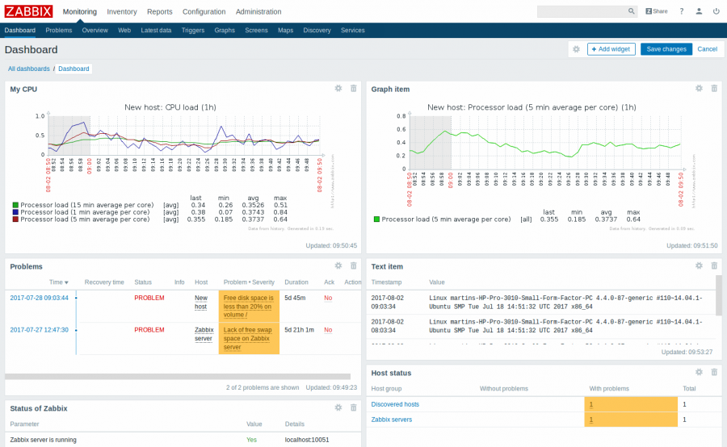
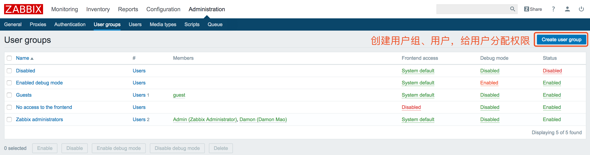
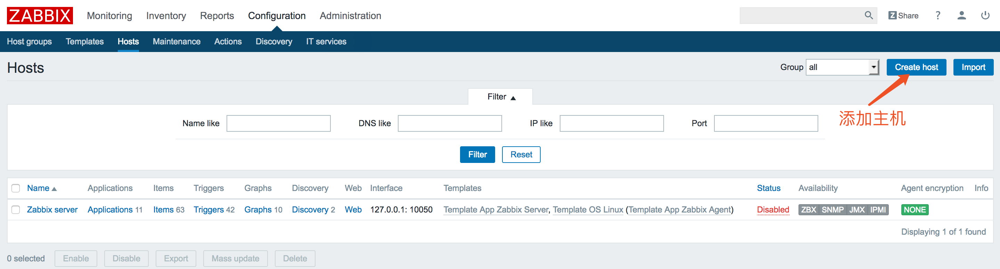
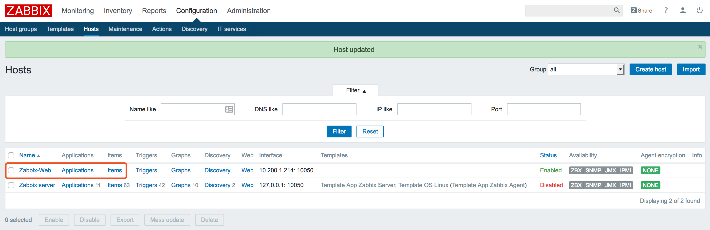
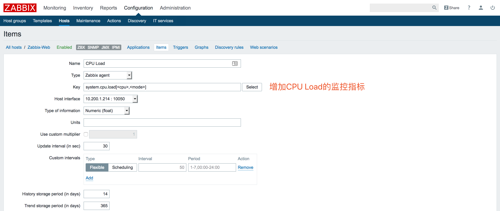
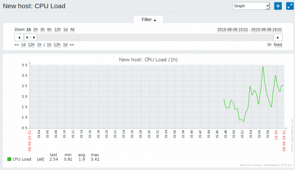
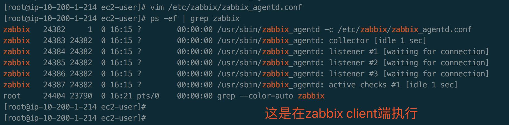
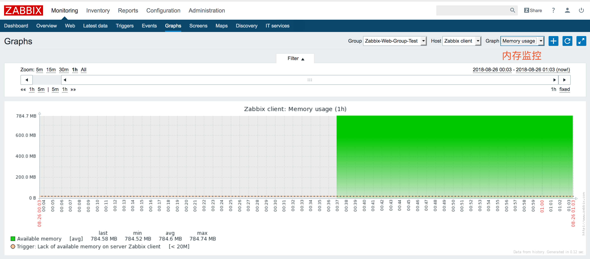
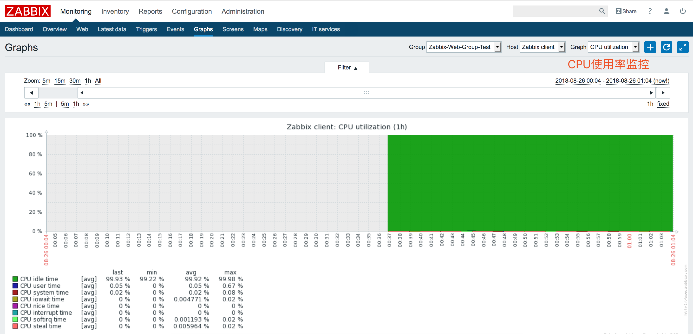

## 安装Zabbix

Zabbix 是一个企业级的分布式开源监控方案。

Zabbix是一款能够监控各种网络参数以及服务器健康性和完整性的软件。Zabbix使用灵活的通知机制，允许用户为几乎任何事件配置基于邮件的告警。这样可以快速反馈服务器的问题。基于已存储的数据，Zabbix提供了出色的报告和数据可视化功能。这些功能使得Zabbix成为容量规划的理想方案。

安装要求: Zabbix同时需要物理内存和磁盘空间。刚开始使用Zabbix，建议128MB物理内存和256MB可用磁盘空间。如果计划对监控的参数进行长期保存，应考虑至少在数据库中预留几个GB的空间，以用来保留历史数据。 每个Zabbix的守护进程需要与数据库服务器建立多个连接。分配给连接的内存数量，取决于数据库引擎的配置。



https://yunjin-keji.com/install-zabbix3-on-amazon-linux 

## 一、安装Zabbix以及核心组件

监控主机数量达到上千台，数据库建议是使用PostgreSQL 8.3以上的版本**

```bash
$ sudo yum update -y
$ cat /etc/system-release
Amazon Linux AMI release 2018.03
```

安装http24

```bash
[ec2-user@ip-10-200-1-44 ~]$ sudo -s
[root@ip-10-200-1-44 ec2-user]# yum install httpd24 -y
[root@ip-10-200-1-44 ec2-user]# chkconfig httpd on
[root@ip-10-200-1-44 ec2-user]# chkconfig httpd on  //设置开机自动启动
[root@ip-10-200-1-44 ec2-user]# service httpd start //启动httpd
Starting httpd: 

```

安装PHP5.6

```bash
[root@ip-10-200-1-44 ec2-user]# yum install php56 php56-devel php56-mbstring php56-mcrypt php56-pgsql php56-bcmath php56-gd php56-ldap -y
```

修改PHP时间戳

```bash
[root@ip-10-200-1-44 ec2-user]# sed -i -e "s/;date.timezone =/date.timezone = Asia\/Shanghai/g" /etc/php.ini
```

安装Zabbix，yum安装Zabbix及相关安装包

```bash
[root@ip-10-200-1-44 ec2-user]# rpm -ivh http://repo.zabbix.com/zabbix/3.0/rhel/6/x86_64/zabbix-release-3.0-1.el6.noarch.rpm
```

查看最新Zabbix版本（裸机采用https方式安装会出错，换成http是可以的。）
https://www.zabbix.com/documentation/3.4/zh/manual/installation/install_from_packages

```bash
rpm -ivh http://repo.zabbix.com/zabbix/3.4/rhel/6/x86_64/zabbix-release-3.4-1.el6.noarch.rpm  
```

安装Zabbix监控的相关组件（采用pgsql）

```bash
[root@ip-10-200-1-44 ec2-user]# yum install -y \
> zabbix-agent \
> zabbix-web \
> zabbix-web-pgsql \
> zabbix-server-pgsql \
> zabbix-sender \
> zabbix-java-gateway \
> zabbix-get
```

```bash
也可以安装mysql引擎，但是生产环境机器数据很多的话官网建议使用pgsql
yum install zabbix-server-mysql zabbix-web-mysql
```

**被监控服务器安装比较简单，只安装Zabbix Agent即可，如下:**

```bash
[root@ip-10-200-1-214 ec2-user]# yum install zabbix-agent
```

拷贝Zabbix使用的httpd配置文件

```bash
[root@ip-10-200-1-44 doc]# cp -p /usr/share/doc/zabbix-web-3.0.20/httpd24-example.conf /etc/httpd/conf.d/zabbix.conf
[root@ip-10-200-1-44 doc]# service httpd restart
Stopping httpd:                                            [  OK  ]
Starting httpd:                                            [  OK  ]
```

安装postgresql

```bash
[root@ip-10-200-1-44 doc]# yum install postgresql postgresql-server postgresql-devel postgresql-contrib -y
确认安装的版本
[root@ip-10-200-1-44 doc]# psql --version
psql (PostgreSQL) 9.2.24
```

初始化及启动postgresql

```bash
[root@ip-10-200-1-44 doc]# service postgresql initdb
Initializing database:                                     [  OK  ]
[root@ip-10-200-1-44 doc]# service postgresql start
Starting postgresql service:                               [  OK  ]
```

默认用户postgres设定密码

```bash
[root@ip-10-200-1-44 doc]# su - postgres
-bash-4.2$ psql
psql (9.2.24)
Type "help" for help.

postgres=# alter role postgres with password 'postgres';
ALTER ROLE
postgres=# \q
```

修改postgresql认证方法

```bash
$ vi /var/lib/pgsql9/data/pg_hba.conf
# "local" is for Unix domain socket connections only
local   all             all                                     md5
# IPv4 local connections:
host    all             all             127.0.0.1/32            md5
-bash-4.2$ exit
logout

[root@ip-10-200-1-44 doc]# service postgresql restart
Stopping postgresql service:                               [  OK  ]
Starting postgresql service:                               [  OK  ]
```

创建用户zabbix，并设定密码。

```bash
[root@ip-10-200-1-44 doc]# su - postgres
上一次登录：五 8月 24 16:42:01 UTC 2018pts/0 上
-bash-4.2$ createuser -P zabbix
Enter password for new role: 输入密码
Enter it again: 
Password: 再次输入密码
```

创建数据库。

```bash
-bash-4.2$ createdb -O zabbix -E UTF8 zabbix
-bash-4.2$ psql -l
Password:
                                  List of databases
   Name    |  Owner   | Encoding |   Collate   |    Ctype    |   Access privileges
-----------+----------+----------+-------------+-------------+-----------------------
 postgres  | postgres | UTF8     | en_US.UTF-8 | en_US.UTF-8 |
 template0 | postgres | UTF8     | en_US.UTF-8 | en_US.UTF-8 | =c/postgres          +
           |          |          |             |             | postgres=CTc/postgres
 template1 | postgres | UTF8     | en_US.UTF-8 | en_US.UTF-8 | =c/postgres          +
           |          |          |             |             | postgres=CTc/postgres
 zabbix    | zabbix   | UTF8     | en_US.UTF-8 | en_US.UTF-8 |
(4 rows)
```

导入zabbix数据

```bash
zcat /usr/share/doc/zabbix-server-pgsql-3.0.20/create.sql.gz | psql -U zabbix zabbix -W
INSERT 0 1
INSERT 0 1
INSERT 0 1
INSERT 0 1
INSERT 0 1
INSERT 0 1
COMMIT
```

修改zabbix配置文件，配置数据库连接信息，主要是DBHost=localhost、DBName=zabbix、DBUser=zabbix、DBPassword=zabbix

```bash
-bash-4.2$ exit
logout
# vi /etc/zabbix/zabbix_server.conf
---
# DBPassword=
↓
DBPassword=<Password>
```

启动zabbix-server并配置为开机自动启动

```bash
[root@ip-10-200-1-44 doc]# vi /etc/zabbix/zabbix_server.conf
---
# DBPassword=
↓
DBPassword=<Password>
[root@ip-10-200-1-44 doc]# service zabbix-server start //启动Zabbix Server进程 
Starting Zabbix server:                                    [  OK  ]
[root@ip-10-200-1-44 doc]# chkconfig zabbix-server on  //设置开机自启动
```

**看情况编辑Zabbix前端的PHP配置**

Zabbix前端的Apache配置文件位于 /etc/apache2/conf.d/zabbix 或者 /etc/apache2/conf-enabled/zabbix.conf 。一些PHP设置已经完成了配置。

```bash
php_value max_execution_time 300
php_value memory_limit 128M
php_value post_max_size 16M
php_value upload_max_filesize 2M
php_value max_input_time 300
php_value always_populate_raw_post_data -1
# php_value date.timezone Europe/Riga
```

依据所在时区，你可以取消 “date.timezone” 设置的注释，并正确配置它。在配置文件更改后，需要重启Apache Web服务器。

```bash
service apache2 restart
```

## 二、Web界面安装Zabbix


EC2公网IP: 52.80.221.137，Zabbix UI界面安装地址: http://52.80.221.137/zabbix/ (访问地址已失效)


Zabbix监控平台安装成功。默认的用户名／密码为 Admin/zabbix。


## 三、Zabbix升级，大致骤分为7个。

https://www.zabbix.com/documentation/3.4/zh/manual/installation/upgrade

## 四、Zabbix用户管理

在*管理（Administration） → 用户（Users）*下 查看用户信息

 Zabbix在安装后只定义了两个用户。 

-  'Admin' 用户是Zabbix的一个超级管理员，拥有所有权限。 
-  'Guest' 用户是一个特殊的默认用户。如果你没有登陆，你访问Zabbix的时候使用的其实是“guest”权限。默认情况下，“guest”用户对Zabbix中的对象没有任何权限。

例如，我创建了一个Damon Mao的用户，并加入到Zabbix administrator组。



## 五、添加监控主机

Zabbix中，可以通过*配置（Configuration）→ 主机（Hosts）*菜单，查看已配置的主机信息。默认已有一个名为'Zabbix server'的预先定义好的主机。





## 六、新增监控项

监控项是Zabbix中获得数据的基础。没有监控项，就没有数据——因为一个主机中只有监控项定义了单一的指标或者需要获得的数据。



 如果你在当前界面中没有看到监控项的信息，请确认： 

-  你输入的监控项'值（Key）' 和 '信息类型（Type of information）' 同截图中的一致
-  agent和server都在运行状态
-  主机状态为'监控（Monitored）'并且它的可用性图标是绿色的 
-  监控项处于启用状态

##### 图表

当监控项运行了一段时间后，可以查看可视化图表。  [简单图表](https://www.zabbix.com/documentation/3.4/manual/config/visualisation/graphs/simple) 适用于任何被监控的数值型（numeric）监控项，且不需要额外的配置。这些图表会在运行时生成。 

前往*监控（Monitoring） → 最新数据（Latest data）*，然后点击监控项后的'图表（Graph）'链接以查看图表。 



## 七、新建触发器


## 八、Zabbix Client客户端配置

```bash
[root@ip-10-200-1-214 ec2-user]# rpm -ivh http://repo.zabbix.com/zabbix/3.4/rhel/6/x86_64/zabbix-release-3.4-1.el6.noarch.rpm
获取http://repo.zabbix.com/zabbix/3.4/rhel/6/x86_64/zabbix-release-3.4-1.el6.noarch.rpm
准备中...                          ################################# [100%]
正在升级/安装...
   1:zabbix-release-3.4-1.el6     ################################# [100%]
```

**被监控服务器安装比较简单，只安装Zabbix Agent即可，如下:**

```bash
[root@ip-10-200-1-214 ec2-user]# yum install zabbix-agent
```

修改配置

```bash
[root@ip-10-200-1-214 ec2-user]# vim /etc/zabbix/zabbix_agentd.conf
```

**主动模式和被动模式:** 

主动或者被动是**相对客户端**来讲的  被动模式，服务端会主动连接客户端获取监控项目数据，客户端被动地接受连接，并把监控信息传递给服务端  主动模式，客户端会主动把监控数据汇报给服务端，服务端只负责接收即可。当客户端数量非常多时，建议使用**主动**模式，这样可以降低服务端的压力。

服务端有公网ip，客户端只有内网ip，但却能连外网，这种场景适合主动模式。

这是自定义的主机名，一会还需要在web界面下设置同样的主机名。

```bash
Server=10.200.1.44			#定义服务端的ip（被动模式）
ServerActive=10.200.1.44	#定义服务器端的ip（主动模式）
Hostname=zabbix_server1		#这是自定义的主机名，一会还需要在web界面下设置同样的主机名。
PidFile=/var/run/zabbix/zabbix_agentd.pid
LogFile=/var/log/zabbix/zabbix_agentd.log
```

设置zabbix-agent开机自动启动

```bash
[root@ip-10-200-1-214 ec2-user]# chkconfig zabbix-agent on
```

启动zabbix-agent

```bash
[root@ip-10-200-1-214 ec2-user]# service zabbix-agent start
Starting Zabbix agent:                                     [  OK  ]
```

确认启动成功

```bash
[root@ip-10-200-1-214 ec2-user]# ps -ef | grep zabbix
```



然后在Zabbix Server端执行，有返回说明成功了。

```bash
[ec2-user@ip-10-200-1-44 etc]$ zabbix_get -s 10.200.1.214 -p10050 -k"system.uptime"
23440
```

内存指标监控



CPU使用率指标监控



zabbix_agent端自动安装脚本，仅供参考：http://blog.51cto.com/pynliu/1569596

```bash
#!/bin/bash
# time 2014/12/04 11:00  by Lance
PATH=/usr/local/sbin:/usr/local/bin:/sbin:/bin:/usr/sbin:/usr/bin:/root/bin
export PATH

#server IP
ip=172.16.8.129

#zabbix源码文件存放目录
dir_zabbix=/vol/myfile

#判断zabbix是否已安装
check_install(){
if [ -f /etc/init.d/zabbix* ]; then
	echo "`ls /etc/init.d/zabbix*`启动脚本已存在!"
fi
if [ -d /usr/local/zabbix*  ]; then
	echo "`ls -d /usr/local/zabbix`目录已存在!"
	echo "安装停止"
	exit 0
fi
}

#添加zabbix用户
check_user(){
if [ `grep zabbix /etc/passwd|wc -l` -lt 1 ]; then
	useradd zabbix -s /sbin/nolog
fi
}

#1.验证zabbix程序是否在/vol/myfile目录下：
check_zabbix_file(){
if [ ! -f $dir_zabbix/zabbix* ];then
	echo "zabbix安装程序不存在，请确认放在$dir_zabbix目录下。程序停止!"
	exit 0
else
	echo "文件存在，文件名是:`ls $dir_zabbix/zabbix*.gz`"
fi

echo "检查完毕，开始安装。。。"
sleep 3
}

#2.解压
configure_make(){
#date >>$dir_zabbix/zabbix_install.log
cd $dir_zabbix
tar zxvf zabbix*.gz

#验证编译环境
if [ `rpm -qa gcc gcc-c++ |wc -l` -le 1 ] ; then
	yum install -y gcc gcc-c++
fi

#编译安装
cd $dir_zabbix/zabbix-*
./configure prefix=/usr/local/zabbix --enable-agent 2>> $dir_zabbix/zabbix_install.log
make && make install  2>> $dir_zabbix/zabbix_install.log

#拷贝启动脚本
cp -r misc/init.d/fedora/core/zabbix_agentd /etc/init.d

#删除解压文件
file=`ls $dir_zabbix/zabbix*.tar.gz | awk -F '.tar.gz' '{print $1}'`
rm -rf $file
cd /vol

#修改启动脚本agentd配置文件并设置开机自启--启动脚本
sed -i 's/BASEDIR=\/usr\/local/BASEDIR=\/usr\/local\/zabbix/' /etc/init.d/zabbix_agentd
chmod a+x /etc/init.d/zabbix_agentd
chkconfig zabbix_agentd on

echo "编译安装、开机自启完成！"
sleep 3
}

#3.把zabbix_agent加入系统service
check_service(){
num=`cat /etc/services | grep zabbix|wc -l`
if [ "$num" -le "1" ]; then
cat >>/etc/services <<EOF
zabbix-agent 10050/tcp   # Zabbix Agent
zabbix-agent 10050/udp   # Zabbix Agent
EOF
else
	echo "zabbix已存在系统服务，无修改！"
fi
}

#4.修改zabbix_agentd.conf配置文件
check_agentd(){
#read -p "请输入zabbix监控服务器端IP地址,Server=" i
sed -i "s/^Server=.*/Server=$ip/" /usr/local/zabbix/etc/zabbix_agentd.conf

echo "配置文件agentd修改完成。。。"
sleep 3
}

#5.重启服务
restart(){
/etc/init.d/zabbix_agentd restart

echo "Congratulation , start successful !"
}

####启动提示：
zabbix(){
clear
echo "###############Zabbix_agent安装、检测工具##################"
echo "#                                                         #"
echo "#                    0.自动安装                            #"
echo "#                    1.判断安装文件是否存在                  #"
echo "#                    2.解压并编译安装                       #"
echo "#                    3.检测添加系统服务                     #"
echo "#                    4.修改监控服务器IP                     #"
echo "#                    5.重启服务                            #"
echo "#                                                         #" 
echo "###########################################################"
read -p "请输入安装选项:" cc
case $cc in
0)
check_install && check_user && check_zabbix_file && configure_make && check_service && check_agentd && restart
;;
1)
check_zabbix_file
;;
2)
configure_make
;;
3)
check_service
;;
4)
check_agentd
;;
5)
restart
;;
6)
check_user
;;
*)
echo "输入不合法，请重新输入检测项序号"  && zabbix
;;
esac
}
zabbix
```


