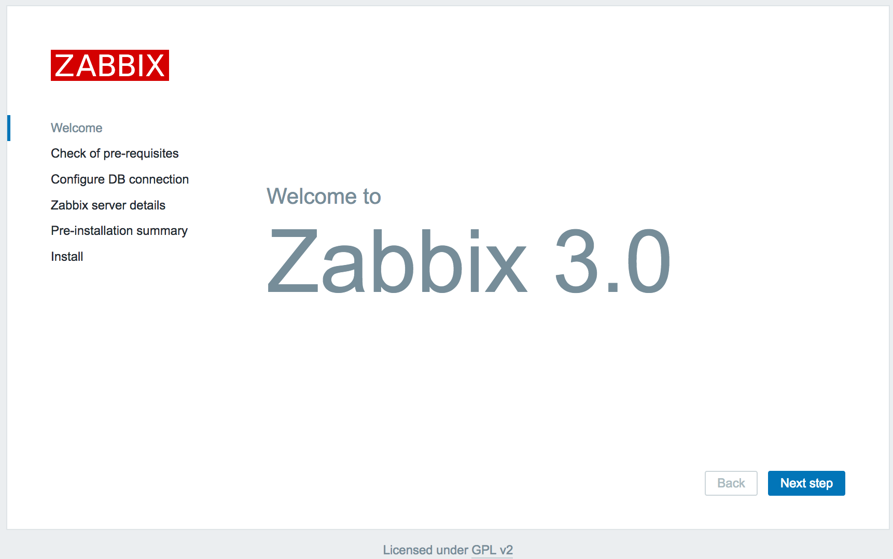
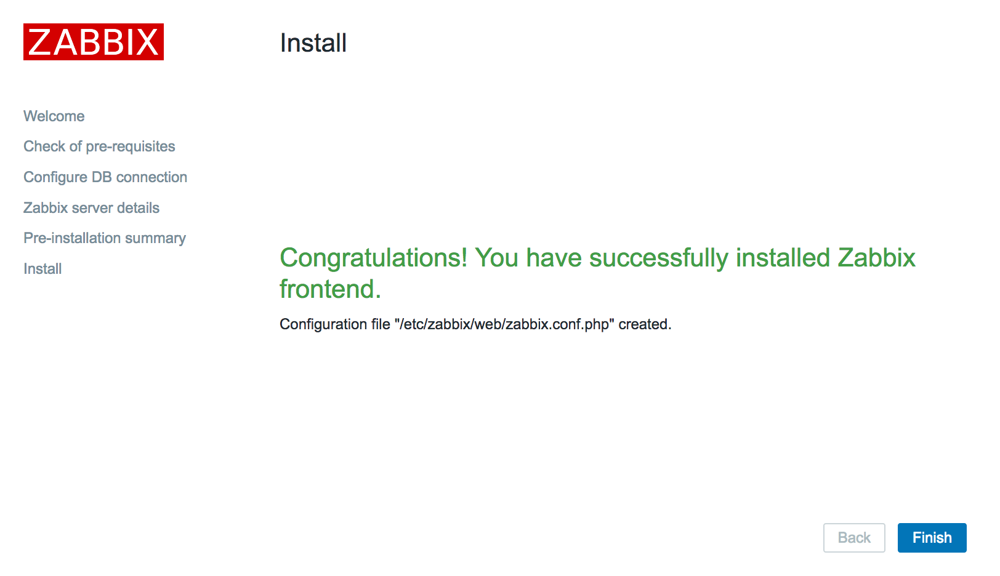
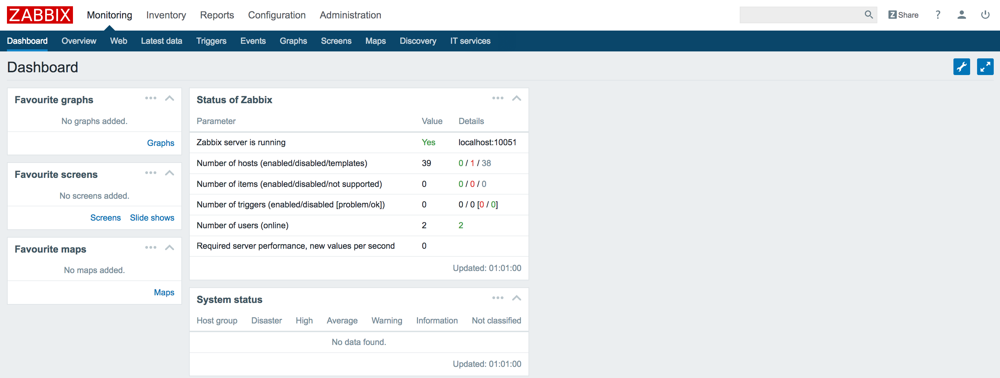

## 安装Zabbix

https://yunjin-keji.com/install-zabbix3-on-amazon-linux

```bash
$ sudo yum update -y
$ cat /etc/system-release
Amazon Linux AMI release 2018.03
```

安装http24

```bash
[ec2-user@ip-10-200-1-44 ~]$ sudo -s
[root@ip-10-200-1-44 ec2-user]# yum install httpd24 -y
[root@ip-10-200-1-44 ec2-user]# chkconfig httpd on
[root@ip-10-200-1-44 ec2-user]# chkconfig httpd on  //设置开机自动启动
[root@ip-10-200-1-44 ec2-user]# service httpd start //启动httpd
Starting httpd: 

```

安装PHP5.6

```bash
[root@ip-10-200-1-44 ec2-user]# yum install php56 php56-devel php56-mbstring php56-mcrypt php56-pgsql php56-bcmath php56-gd php56-ldap -y
```

修改PHP时间戳

```bash
[root@ip-10-200-1-44 ec2-user]# sed -i -e "s/;date.timezone =/date.timezone = Asia\/Shanghai/g" /etc/php.ini
```

安装Zabbix，yum安装Zabbix及相关安装包

```bash
[root@ip-10-200-1-44 ec2-user]# rpm -ivh http://repo.zabbix.com/zabbix/3.0/rhel/6/x86_64/zabbix-release-3.0-1.el6.noarch.rpm
安装Zabbix agent以及相关的组件
[root@ip-10-200-1-44 ec2-user]# yum install -y \
> zabbix-agent \
> zabbix-web \
> zabbix-web-pgsql \
> zabbix-server-pgsql \
> zabbix-sender \
> zabbix-java-gateway \
> zabbix-get
```

拷贝Zabbix使用的httpd配置文件

```bash
[root@ip-10-200-1-44 doc]# cp -p /usr/share/doc/zabbix-web-3.0.20/httpd24-example.conf /etc/httpd/conf.d/zabbix.conf
[root@ip-10-200-1-44 doc]# service httpd restart
Stopping httpd:                                            [  OK  ]
Starting httpd:                                            [  OK  ]
```

安装postgresql

```bash
[root@ip-10-200-1-44 doc]# yum install postgresql postgresql-server postgresql-devel postgresql-contrib -y
确认安装的版本
[root@ip-10-200-1-44 doc]# psql --version
psql (PostgreSQL) 9.2.24
```

初始化及启动postgresql

```bash
[root@ip-10-200-1-44 doc]# service postgresql initdb
Initializing database:                                     [  OK  ]
[root@ip-10-200-1-44 doc]# service postgresql start
Starting postgresql service:                               [  OK  ]
```


默认用户postgres设定密码

```bash
[root@ip-10-200-1-44 doc]# su - postgres
-bash-4.2$ psql
psql (9.2.24)
Type "help" for help.

postgres=# alter role postgres with password 'postgres';
ALTER ROLE
postgres=# \q
```

修改postgresql认证方法

```bash
$ vi /var/lib/pgsql9/data/pg_hba.conf
# "local" is for Unix domain socket connections only
local   all             all                                     md5
# IPv4 local connections:
host    all             all             127.0.0.1/32            md5
-bash-4.2$ exit
logout

[root@ip-10-200-1-44 doc]# service postgresql restart
Stopping postgresql service:                               [  OK  ]
Starting postgresql service:                               [  OK  ]
```

创建用户zabbix，并设定密码。

```bash
[root@ip-10-200-1-44 doc]# su - postgres
上一次登录：五 8月 24 16:42:01 UTC 2018pts/0 上
-bash-4.2$ createuser -P zabbix
Enter password for new role: 输入密码
Enter it again: 
Password: 再次输入密码
```

创建数据库。

```bash
-bash-4.2$ createdb -O zabbix -E UTF8 zabbix
-bash-4.2$ psql -l
Password:
                                  List of databases
   Name    |  Owner   | Encoding |   Collate   |    Ctype    |   Access privileges
-----------+----------+----------+-------------+-------------+-----------------------
 postgres  | postgres | UTF8     | en_US.UTF-8 | en_US.UTF-8 |
 template0 | postgres | UTF8     | en_US.UTF-8 | en_US.UTF-8 | =c/postgres          +
           |          |          |             |             | postgres=CTc/postgres
 template1 | postgres | UTF8     | en_US.UTF-8 | en_US.UTF-8 | =c/postgres          +
           |          |          |             |             | postgres=CTc/postgres
 zabbix    | zabbix   | UTF8     | en_US.UTF-8 | en_US.UTF-8 |
(4 rows)
```

导入zabbix数据

```bash
zcat /usr/share/doc/zabbix-server-pgsql-3.0.20/create.sql.gz | psql -U zabbix zabbix -W
INSERT 0 1
INSERT 0 1
INSERT 0 1
INSERT 0 1
INSERT 0 1
INSERT 0 1
COMMIT
```

修改zabbix配置文件

```bash
-bash-4.2$ exit
logout
# vi /etc/zabbix/zabbix_server.conf
---
# DBPassword=
↓
DBPassword=<Password>
```

启动zabbix-server并配置为开机自动启动

```bash
[root@ip-10-200-1-44 doc]# vi /etc/zabbix/zabbix_server.conf
---
# DBPassword=
↓
DBPassword=<Password>
[root@ip-10-200-1-44 doc]# service zabbix-server start
Starting Zabbix server:                                    [  OK  ]
[root@ip-10-200-1-44 doc]# chkconfig zabbix-server on
```

Web安装Zabbix



公网IP: 52.80.221.137，Zabbix UI界面安装地址: http://52.80.221.137/zabbix/



Zabbix监控平台安装成功

